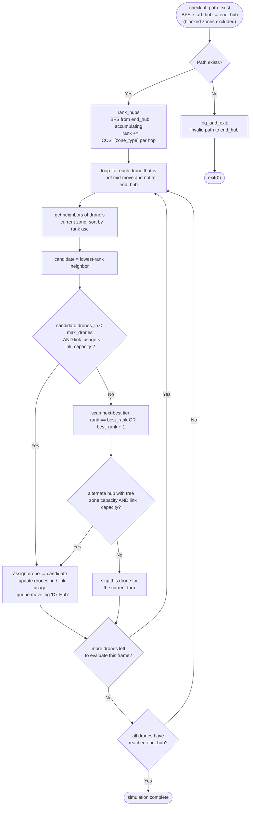

*This project has been created as part of the 42 curriculum by zboualam.*

## Description

This project simulates a fleet of drones traveling from a **start hub** to an
**end hub** across a network of interconnected zones. It is built around two
main pieces:

- A **custom map parser** (`my_parser.py`) that reads a text description of
  a network (number of drones, hubs/zones with coordinates and properties,
  and the connections between them), validates the syntax, and builds an
  in-memory graph.
- A **Pygame-based simulation/visualization** (`my_graph.py`, `main.py`)
  that ranks every zone by its distance/cost to the end hub, then moves each
  drone step by step along the lowest-cost available path while respecting
  per-zone drone capacity and per-connection link capacity.

Zones can be of different types, each with its own traversal cost and
rendering color:

| Zone type    | Cost | Behavior                                   |
|--------------|------|---------------------------------------------|
| `normal`     | 1    | Standard traversal                          |
| `priority`   | 0.5  | Cheaper / preferred route                   |
| `restricted` | 2    | More expensive, takes two animation "hops"  |
| `blocked`    | ∞    | Impassable                                  |

The goal is to explore graph traversal, capacity-constrained scheduling, and
real-time animation: each turn, every drone picks the best reachable
neighbor based on zone rank, capacity, and link usage, and the simulation
prints a turn-by-turn log of drone movements while rendering them on screen.

## Instructions

### Requirements

- Python 3.10+
- [`uv`](https://github.com/astral-sh/uv) for dependency management
- Pygame (installed automatically through `uv sync`)

### Installation

```bash
make install
```

This installs `uv` and runs `uv sync` to set up the virtual environment and
dependencies declared in the project's `pyproject.toml`/`uv.lock`.

### Running the simulation

```bash
make run
```

This runs the default sample map:

```bash
uv run python3 main.py maps/challenger/01_the_impossible_dream.txt
```

You can run any other map file the same way:

```bash
uv run python3 main.py path/to/your_map.txt
```

### Map file format (quick reference)

```
nb_drones: <positive integer>

start_hub: <name> <x> <y> [zone=normal color=gold max_drones=2]
hub:       <name> <x> <y> [zone=restricted color=sapphire max_drones=1]
end_hub:   <name> <x> <y> [zone=priority color=lime max_drones=2]

connection: <hub_a>-<hub_b> [max_link_capacity=2]
```

- The first non-comment, non-empty line must declare `nb_drones`.
- Exactly one `start_hub` and one `end_hub` are required.
- `hub` lines define intermediate zones; metadata (`zone`, `color`,
  `max_drones`) is optional and defaults to `normal` / white / `1`.
- `connection` lines link two existing zones and may set a
  `max_link_capacity` (defaults to `1`).
- Lines starting with `#`, or anything after a `#`, are treated as comments.

### Debugging

```bash
make debug
```

Runs `main.py` under `pdb` for step-by-step debugging.

### Linting & type checking

```bash
make lint
```

Runs `flake8` and `mypy` (with strict-ish flags: `--warn-return-any
--warn-unused-ignores --ignore-missing-imports --disallow-untyped-defs
--check-untyped-defs`).

### Cleaning build artifacts

```bash
make clean
```

Removes `__pycache__`, `.mypy_cache`, and `.vscode` directories.

## Algorithm Design & Implementation Strategy

The simulation logic runs in two phases: a one-time **setup phase** (path
validation + ranking) and a repeating **per-frame scheduling phase** (drone
movement decisions). The flowchart below documents the scheduling loop,
refined from the original design sketch to make explicit the two capacity
checks the implementation actually performs (zone capacity *and* link
capacity).



### Path validation — `path_exist`

A plain **BFS** from `start_hub`, skipping any zone whose type is `blocked`,
confirms a route to `end_hub` exists *before* any rendering or ranking work
is done. This fails fast on malformed maps and avoids wasting cycles on an
unsolvable network.

### Ranking — `rank_hubs`

Rather than ranking by raw hop-count, `rank_hubs` performs a BFS **outward
from `end_hub`** and accumulates `rank = parent.rank + COST[zone_type]` at
each hop, where `COST` is `{normal: 1, priority: 0.5, restricted: 2,
blocked: ∞}`. This turns the traversal into a *cost-weighted* distance
field: a `priority` zone pulls neighboring ranks down (cheaper, so more
attractive), while a `restricted` zone pushes them up (more expensive). The
result is a single number per zone — its rank — that every drone can use
locally to decide "which neighbor gets me closer to the exit, accounting
for zone cost."

This is intentionally simple (single-pass BFS, not a full Dijkstra
priority-queue relaxation) because zone costs are small, static, and known
upfront — the network doesn't need re-ranking once computed, only the
drones' *positions* change each frame.

### Per-drone move selection — `find_next_move`

Each frame, every idle drone (not currently animating between zones, and
not already at `end_hub`) independently chooses its next hop using a
**greedy, rank-first heuristic** with two layers of capacity awareness:

1. **Best choice**: the directly-connected neighbor with the lowest rank.
   It's only taken if the target zone still has room
   (`drones_in < max_drones`) *and* the connecting link hasn't hit its
   `max_link_capacity`.
2. **Fallback tier**: if the best choice is full or its link is saturated,
   the drone scans connections again for any neighbor whose rank equals the
   best rank **or one tier higher** — i.e., "almost as good." The first one
   with free zone and link capacity is taken instead.
3. **Skip**: if nothing in either tier is available, the drone simply waits
   one turn and re-evaluates on the next frame.

This greedy-with-fallback approach was chosen over a global optimal
assignment (e.g., max-flow / min-cost-flow over all drones at once) because
it keeps the algorithm **local and frame-cheap** — each drone only inspects
its own immediate connections — which matters since the decision runs
every animation frame inside the Pygame loop, not once per "turn."
Capacity bookkeeping (`drones_in` per zone, `links_in_use` per connection)
is incremented the moment a drone *commits* to a move and decremented only
once it fully arrives, which prevents two drones from being scheduled onto
the same constrained slot in the same frame.

### Restricted zones — two-phase movement

A move into a `restricted` zone is split into two animation segments: the
drone first travels to the **midpoint** between source and target, then
continues to the target on the next decision cycle. This mirrors the
zone's higher `COST` (2 vs. 1 for `normal`) by literally taking the drone
twice as long, in animation time, to cross it — turning an abstract cost
value into something visibly slower on screen.

### Turn logging

Every committed move is appended to the moving drone's `logs` list and
flushed to stdout (`Dx-Hub` format) the frame it occurs, with a shared
`turns` counter incremented once per frame in which *any* drone logs a
move. This gives a deterministic, replayable text trace of the simulation
that's independent of frame rate, alongside the real-time animation.

## Visual Representation & User Experience

The Pygame front end exists to make an otherwise abstract scheduling
problem easy to *read at a glance*, rather than just to animate it:

- **Color-coded zone types**: each zone is drawn as a filled circle using
  its configured `color`, and every edge leaving a zone is drawn in a
  fixed color tied to that zone's type — white for `normal`, red for
  `blocked`, yellow for `restricted`, green for `priority`
  (`graph_data.edge_colors`). This lets a viewer instantly recognize
  which routes are cheap, expensive, or impassable without reading any
  numbers.
- **Layered node rendering**: nodes are drawn as a soft outer ring plus an
  inner colored disc (`Zone.draw_node`), giving each hub visual weight and
  making it easy to distinguish hubs from edges and drones at a glance.
- **Smooth interpolated drone movement**: instead of teleporting between
  zones, drones move via linear interpolation
  (`drone_start + (target - drone_start) * progress`) over several
  frames, at a constant `graph_data.SPEED`. This turns discrete graph
  "turns" into continuous, easy-to-follow motion — and combined with the
  two-phase restricted-zone movement, the *relative cost* of a zone
  becomes visible as relative *speed*, not just a number in a log.
- **Random drone sprites**: each drone is assigned a random image from a
  small pool (`graph_data.drones`), making individual drones visually
  distinguishable as they move through the network, especially useful
  when many drones converge on the same hub.
- **Free camera panning**: click-and-drag (`Display.dragging`) offsets a
  `camera_x`/`camera_y` pair used by every draw call, so maps larger than
  the 1600×800 window remain fully explorable without needing to scale
  down (and lose readability of) the zone layout.
- **Live status overlay**: the current turn count is rendered each frame
  (`Display.write_text`) directly on the canvas, keeping the textual and
  visual representations of progress in sync without requiring the user
  to watch the terminal log separately.

Together these choices favor **legibility over realism**: the goal isn't a
literal drone simulator, but a way to *see* the routing algorithm's
decisions — capacity bottlenecks, rank-based routing, and cost differences
between zone types — unfold in real time.

## Resources

### Classic references

- [Pygame documentation](https://www.pygame.org/docs/) — window
  management, event loop, drawing primitives, image loading/scaling, and
  the `Clock` API used for animation timing.
- [Breadth-First Search (BFS) — graph traversal fundamentals](https://en.wikipedia.org/wiki/Breadth-first_search) —
  the underlying technique used both to check path existence and to rank
  hubs by distance/cost from the end hub.
- [Dijkstra's algorithm / weighted shortest path](https://en.wikipedia.org/wiki/Dijkstra%27s_algorithm) —
  conceptual basis for ranking zones by cumulative zone-traversal cost
  rather than plain hop count.
- [Greedy algorithms — overview](https://en.wikipedia.org/wiki/Greedy_algorithm) —
  the per-drone, locally-optimal move selection used in
  `Drone.find_next_move` instead of a globally optimal flow assignment.

- [uv documentation](https://docs.astral.sh/uv/) — dependency
  installation and virtual environment management (`uv sync`,
  `uv run`).
- [webcolors documentation](https://webcolors.readthedocs.io/) — used in
  `my_parser.py` to resolve named CSS colors to RGB tuples.
- [mypy documentation](https://mypy.readthedocs.io/) and
  [flake8 documentation](https://flake8.pycqa.org/) — static typing and
  linting rules enforced by `make lint`.
- [Python `re` module documentation](https://docs.python.org/3/library/re.html) —
  regular expressions used throughout `my_parser.py` for line validation.

### Use of AI

AI assistance (an LLM-based coding assistant) was used during this
project in the following ways:

- **Docstrings & type hints**: generating and standardizing Google-style
  docstrings and type annotations across `main.py`, `my_graph.py`, and
  `my_parser.py` for clarity and to satisfy the strict `mypy`/`flake8`
  checks configured in the `Makefile`.
- **Debugging support**: helping diagnose edge cases in the parser's
  regular expressions (hub/connection syntax) and in the drone movement
  state machine (e.g., handling the two-step animation for `restricted`
  zones).
- **Documentation**: drafting this README, including refining the
  algorithm flowchart (originally hand-sketched) into a Mermaid diagram
  and writing the accompanying algorithm/visualization write-ups.